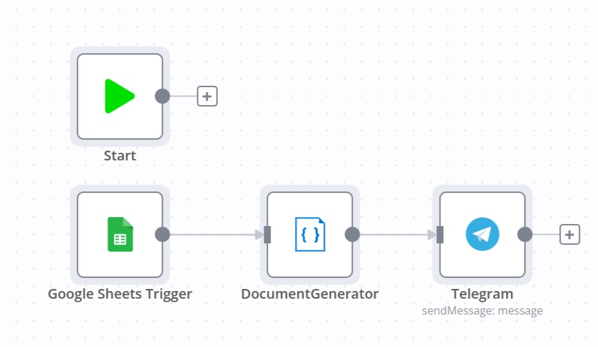
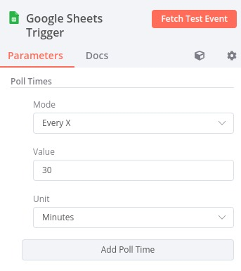
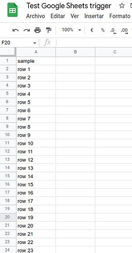
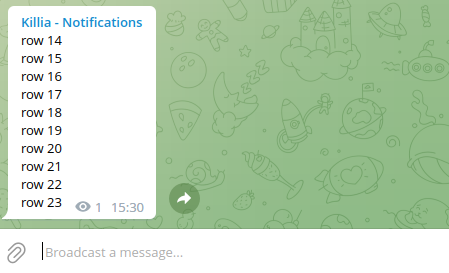

# n8n-nodes-google-sheets-trigger

This is an n8n community node. It lets you use Google Sheets in trigger mode with your n8n workflows.
Using this trigger, you will be able to recover only new rows from any Google sheet.

# Contents

[TLDR](#TLDR)  

[Installation](#installation)  

[Operations](#operations)  

[Credentials](#credentials)

[Compatibility](#compatibility)  

[Usage](#usage)

[Version history](#version-history)

[Another way to try it out](#another-way-to-try-it-out)

[Contribution](#contribution)

[Issues](#issues)

[Resources](#resources)

[License](#license)

# TLDR
Don't want to read? Import the sample workflow [Recover only new rows from Google Sheets](https://app.n8n.io/workflows/1812) to test this node.


# Installation
Follow the [installation guide](https://docs.n8n.io/integrations/community-nodes/installation/) in the n8n community nodes documentation.

# Operations
Using this node you recover only new rows added to any Google sheet.

# Credentials
You can choose any credential defined in other Google Sheets nodes. 
All credentials are compatible.

# Compatibility
Tested with node 0.197.1.
You need an n8n version with polling enabled.

# Usage

With this node, you will be able to recover new rows added to any sheet.

Define your Google sheets node as usual (credentials, spreadsheet id, range, raw data) and choose your poll time



If you want the sample sheet, access the [sample spreadsheet](https://docs.google.com/spreadsheets/d/1UzzxzEy6N-B_A3bWGEm-iDa0fM1n7v2JNb2a7q8y_To/edit?usp=sharing) and copy it to your Google Drive.

Google sheet contains a list of numbered rows:




You have a sample below where I combine new rows from Google Sheets with [Generate dynamic contents for EMAILS or HTML pages](https://app.n8n.io/workflows/1790) (this is another community node created by me).

Then, create a new template for this node:

```
{{#each items}}
{{sample}}
{{/each}}
```

First, execute the workflow directly to recover all rows and test the message to Telegram.
Polling and recovering new rows only work for active tasks in the background.
Define the poll time (every 5 minutes, every hour, every day), and activate your task to get only new rows. 
Check executions to ensure that Workflows are executed every defined poll time.

Now, add new numbered rows (row 24, row, 25, ...) to your Google sheet.
If everything works as expected, a new message is sent to the Telegram channel with new rows.

This is a sample of how the message looks (I added rows 14 to 23).




# Version history

* 2022/10/12 - Initial version for Google Sheets Trigger

# Another way to try it out

Clone the n8n-nodes-google-sheets-trigger repository and execute:
```
# Use v16.17.0 = lts/gallium
nvm use lts/gallium

# Install dependencies
npm install

# Build the code
npm run build

# "Publish" the package locally
npm link
```

Create an N8N installation and add the n8n-nodes-document-generator to it:
```
# Create an N8N installation
cd ..
mkdir n8n_install
cd n8n_install
npm init
npm install
npm install n8n

# "Install" the locally published module
npm link n8n-nodes-google-sheets-trigger

# Start n8n
npx n8n
```

# Contribution
To make this node even better, please let us know, [how you use it](mailto:miquel@n8nhackers.com). Commits are always welcome.

# Issues
If you have any issues, please [let us know on GitHub](https://github.com/n8nhackers/n8n-nodes-google-sheets-trigger/issues).

# About
Node by [n8nhackers.com](https://n8nhackers.com). For productive use and consulting on this, [contact us please](mailto:contact@n8nhackers.com).

Special thanks to [N8n nodemation](https://n8n.io) workflow automation by Jan Oberhauser.

# Resources
If you want to build your custom n8n nodes, check the [N8N documentation on custom nodes](https://docs.n8n.io/nodes/creating-nodes/create-n8n-nodes-module.html).


# Licenses
* [n8n](https://n8n.io/) is a [fair-code licensed](https://docs.n8n.io/reference/license/) workflow automation platform.
* [MIT](https://github.com/n8n-io/n8n-nodes-starter/blob/master/LICENSE.md)
